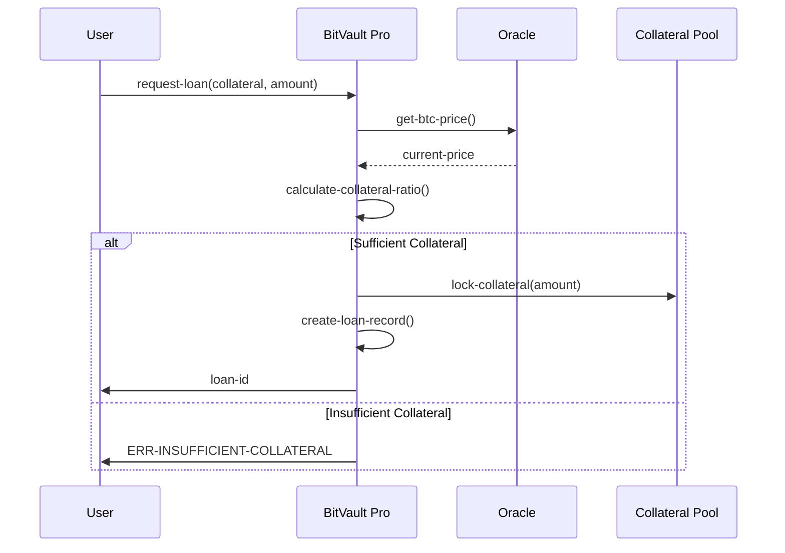
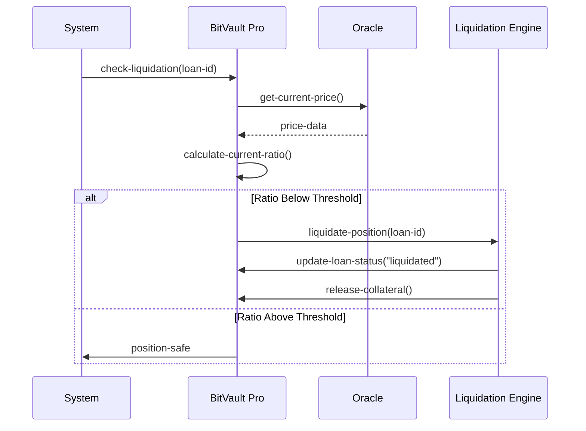

# BitVault Pro - Advanced Bitcoin Collateralized Lending Protocol

[](https://opensource.org/licenses/MIT)
[](https://clarity-lang.org/)
[](https://stacks.co/)

> **Revolutionary DeFi lending protocol enabling Bitcoin holders to unlock liquidity while maintaining digital asset exposure through institutional-grade risk management.**

## 🚀 Overview

BitVault Pro is a cutting-edge decentralized lending protocol built on the Stacks blockchain that allows Bitcoin holders to collateralize their BTC holdings to access stablecoin liquidity. The protocol implements sophisticated risk management algorithms, dynamic collateralization ratios, and automated liquidation protection to ensure platform stability and capital efficiency.

### Key Features

- **🔐 Trustless Collateralization**: Secure Bitcoin-backed loans without third-party custody
- **⚡ Dynamic Risk Management**: Real-time collateral ratio monitoring and adjustment
- **🛡️ Automated Liquidation Protection**: Algorithmic position management to prevent losses
- **📊 Multi-Asset Support**: Extensible framework for various digital assets
- **🎯 Institutional Grade**: Enterprise-level security and risk protocols
- **🔄 Flash Liquidation Prevention**: Advanced mechanisms to protect borrower positions

## 🏗️ System Architecture

### High-Level Architecture

```
┌─────────────────────────────────────────────────────────────────┐
│                        BitVault Pro Protocol                    │
├─────────────────────────────────────────────────────────────────┤
│                                                                 │
│  ┌─────────────────┐    ┌─────────────────┐    ┌─────────────┐  │
│  │   Collateral    │    │   Loan Engine   │    │   Oracle    │  │
│  │   Management    │◄───┤                 │◄───┤   System    │  │
│  │                 │    │                 │    │             │  │
│  └─────────────────┘    └─────────────────┘    └─────────────┘  │
│           │                       │                      │      │
│           ▼                       ▼                      ▼      │
│  ┌─────────────────┐    ┌─────────────────┐    ┌─────────────┐  │
│  │   Liquidation   │    │   Interest      │    │   Governance│  │
│  │   Engine        │    │   Calculator    │    │   Module    │  │
│  │                 │    │                 │    │             │  │
│  └─────────────────┘    └─────────────────┘    └─────────────┘  │
│                                                                 │
└─────────────────────────────────────────────────────────────────┘
```

### Core Components

#### 1. **Collateral Management System**

- Handles Bitcoin deposits and withdrawals
- Maintains collateral-to-loan ratio calculations
- Manages multi-asset collateral pools

#### 2. **Loan Engine**

- Processes loan requests and approvals
- Manages active loan lifecycle
- Handles repayment and settlement

#### 3. **Risk Management Oracle**

- Real-time price feed integration
- Dynamic risk parameter adjustment
- Market volatility monitoring

#### 4. **Liquidation Engine**

- Automated position monitoring
- Threshold-based liquidation triggers
- Efficient collateral disposal mechanisms

## 📋 Contract Architecture

### Data Structures

#### Core Maps

```clarity
;; Loan Registry
loans: { loan-id: uint } → LoanData

;; User Tracking
user-loans: { user: principal } → UserLoans

;; Price Oracle
collateral-prices: { asset: string } → PriceData
```

#### State Variables

```clarity
platform-initialized: bool
minimum-collateral-ratio: uint (150%)
liquidation-threshold: uint (120%)
total-btc-locked: uint
total-loans-issued: uint
```

### Function Categories

#### 🔧 Platform Management

- `initialize-platform()` - Initialize the lending protocol
- `update-collateral-ratio()` - Adjust minimum collateral requirements
- `update-liquidation-threshold()` - Modify liquidation trigger points
- `update-price-feed()` - Update asset price oracles

#### 💰 Lending Operations

- `deposit-collateral()` - Deposit Bitcoin collateral
- `request-loan()` - Create new collateralized loan
- `repay-loan()` - Repay loan with interest

#### 📊 Query Functions

- `get-loan-details()` - Retrieve loan information
- `get-user-loans()` - Get user's active loans
- `get-platform-stats()` - Platform statistics

## 🔄 Data Flow

### Loan Creation Process



### Liquidation Process



## 🛡️ Security Features

### Risk Management

- **Overcollateralization**: 150% minimum collateral ratio
- **Liquidation Buffer**: 120% liquidation threshold
- **Price Oracle Integration**: Real-time asset price feeds
- **Position Monitoring**: Continuous collateral ratio tracking

### Access Control

- **Owner-only Functions**: Critical parameter updates restricted
- **User Authentication**: Borrower-specific loan management
- **Input Validation**: Comprehensive parameter checking

## 📈 Economic Model

### Interest Rate Structure

- **Base Rate**: 5% annual interest
- **Dynamic Adjustment**: Market-responsive rate modifications
- **Compound Interest**: Block-based interest calculation

### Collateral Requirements

- **Minimum Ratio**: 150% collateral-to-loan value
- **Liquidation Trigger**: 120% threshold
- **Safety Buffer**: 30% protection margin

## 🚦 Getting Started

### Prerequisites

- Stacks blockchain environment
- Clarity smart contract runtime
- Bitcoin testnet/mainnet access

### Deployment

```bash
# Deploy to testnet
clarinet deploy --network testnet

# Deploy to mainnet
clarinet deploy --network mainnet
```

### Usage Example

```clarity
;; Initialize platform
(contract-call? .bitvault-pro initialize-platform)

;; Update BTC price feed
(contract-call? .bitvault-pro update-price-feed "BTC" u50000000000)

;; Request loan (1 BTC collateral for 0.6 BTC loan)
(contract-call? .bitvault-pro request-loan u100000000 u60000000)
```

## 📊 Platform Statistics

### Key Metrics

- **Total Value Locked (TVL)**: Dynamic based on collateral deposits
- **Active Loans**: Real-time loan count tracking
- **Collateralization Ratio**: Platform-wide average
- **Liquidation Rate**: Historical liquidation frequency

## 🔮 Future Enhancements

### Roadmap

- **Multi-Asset Collateral**: Support for STX, ETH, and other assets
- **Automated Yield Farming**: Integration with DeFi yield protocols
- **Cross-Chain Compatibility**: Bridge to other blockchain networks
- **Governance Token**: Decentralized protocol governance
- **Flash Loan Support**: Instant liquidity without collateral

## 🤝 Contributing

We welcome contributions from the DeFi community. Please read our contributing guidelines and submit pull requests for review.

## 📄 License

This project is licensed under the MIT License - see the [LICENSE](LICENSE) file for details.
